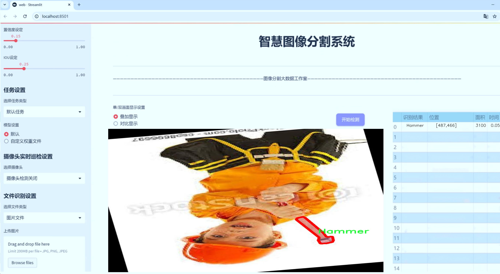
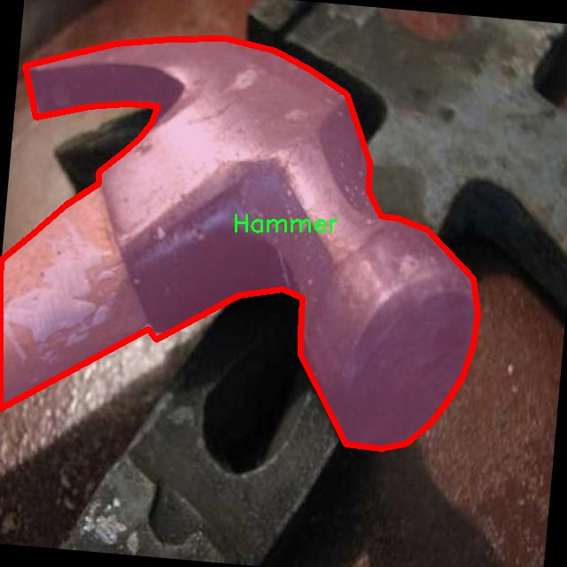

# 五金工具物体分割系统源码＆数据集分享
 [yolov8-seg-KernelWarehouse＆yolov8-seg-C2f-DCNV3等50+全套改进创新点发刊_一键训练教程_Web前端展示]

### 1.研究背景与意义

项目参考[ILSVRC ImageNet Large Scale Visual Recognition Challenge](https://gitee.com/YOLOv8_YOLOv11_Segmentation_Studio/projects)

项目来源[AAAI Global Al lnnovation Contest](https://kdocs.cn/l/cszuIiCKVNis)

研究背景与意义

随着工业自动化和智能制造的迅速发展，物体识别与分割技术在各个领域中的应用愈发广泛，尤其是在生产线的智能监控、机器人抓取、仓储管理等方面。五金工具作为工业生产和日常生活中不可或缺的物品，其准确识别与分割对于提高工作效率、降低人工成本具有重要意义。传统的物体识别方法在复杂环境下的准确性和实时性往往难以满足实际需求，因此，基于深度学习的物体分割技术逐渐成为研究的热点。

YOLO（You Only Look Once）系列模型因其高效的实时性和较好的准确性而受到广泛关注。YOLOv8作为该系列的最新版本，采用了先进的网络结构和优化算法，能够在保证速度的同时提升识别精度。然而，现有的YOLOv8模型在特定应用场景下仍存在一定的局限性，尤其是在处理复杂背景和多类物体时，分割效果不尽如人意。因此，针对五金工具的特定需求，对YOLOv8进行改进，以提升其在物体分割任务中的表现，具有重要的研究价值。

本研究围绕“Optobot-Hammer”数据集展开，该数据集包含1000张图像，涵盖了三类五金工具：陀螺仪、锤子和剪刀。这些工具在工业生产和日常生活中应用广泛，具有不同的形状、颜色和纹理特征。通过对这些图像进行实例分割，不仅可以实现对单个物体的精确识别，还能在复杂场景中有效区分相似物体，进而为后续的自动化操作提供支持。数据集的构建和标注为本研究提供了坚实的基础，使得模型的训练和验证能够在真实场景中进行。

本研究的意义在于，首先，通过改进YOLOv8模型，能够显著提升五金工具的物体分割精度，为工业生产中的智能识别和自动化操作提供技术支持。其次，研究结果将为物体分割领域的学术研究提供新的思路和方法，推动相关技术的进步。此外，改进后的模型可以在其他领域中推广应用，如智能家居、安防监控等，具有广泛的应用前景。

综上所述，基于改进YOLOv8的五金工具物体分割系统的研究，不仅有助于解决实际应用中的技术难题，也为深度学习在物体识别与分割领域的进一步发展提供了新的视角和实践经验。通过本研究，期望能够推动五金工具智能识别技术的进步，促进相关产业的数字化转型与升级，为实现更高效的生产和管理模式奠定基础。

### 2.图片演示





##### 注意：由于此博客编辑较早，上面“2.图片演示”和“3.视频演示”展示的系统图片或者视频可能为老版本，新版本在老版本的基础上升级如下：（实际效果以升级的新版本为准）

  （1）适配了YOLOV8的“目标检测”模型和“实例分割”模型，通过加载相应的权重（.pt）文件即可自适应加载模型。

  （2）支持“图片识别”、“视频识别”、“摄像头实时识别”三种识别模式。

  （3）支持“图片识别”、“视频识别”、“摄像头实时识别”三种识别结果保存导出，解决手动导出（容易卡顿出现爆内存）存在的问题，识别完自动保存结果并导出到tempDir中。

  （4）支持Web前端系统中的标题、背景图等自定义修改，后面提供修改教程。

  另外本项目提供训练的数据集和训练教程,暂不提供权重文件（best.pt）,需要您按照教程进行训练后实现图片演示和Web前端界面演示的效果。

### 3.视频演示

[3.1 视频演示](https://www.bilibili.com/video/BV195y3YMEgR/)

### 4.数据集信息展示

##### 4.1 本项目数据集详细数据（类别数＆类别名）

nc: 3
names: ['Fidget-Spinner', 'Hammer', 'Scissors']


##### 4.2 本项目数据集信息介绍

数据集信息展示

在本研究中，我们使用了名为“Optobot-Hammer”的数据集，以训练和改进YOLOv8-seg模型，旨在实现五金工具的高效物体分割。该数据集专门针对特定的物体类别进行了精心构建，涵盖了三种主要的五金工具：Fidget-Spinner、Hammer和Scissors。这些类别的选择不仅考虑了物体的多样性，还考虑了它们在实际应用中的重要性和普遍性，确保模型能够在多种场景下有效识别和分割这些工具。

“Optobot-Hammer”数据集的构建过程包括了大量的图像采集和标注工作。每个类别的图像均经过严格筛选，确保其在不同的光照条件、背景环境和视角下的表现都能体现出该物体的特征。这种多样化的图像来源不仅增强了数据集的代表性，也为模型的训练提供了丰富的样本，提升了其在实际应用中的鲁棒性和准确性。

在数据集的标注过程中，采用了精细的分割技术，确保每个物体的边界都被准确地勾勒出来。这种高质量的标注不仅有助于YOLOv8-seg模型的训练，还能有效减少模型在推理阶段的误差，提高分割的精确度。每个类别的图像均配有相应的分割掩码，这使得模型能够学习到物体的形状、轮廓及其在不同背景下的表现，从而实现更为精准的分割效果。

为了进一步增强模型的泛化能力，数据集还包含了多种不同的背景和场景。这些背景的多样性使得模型在面对复杂环境时，能够更好地适应和识别目标物体。通过在多种环境下进行训练，模型能够学习到如何在不同的条件下进行有效的物体分割，确保其在实际应用中的可靠性。

在数据集的使用过程中，我们将其划分为训练集、验证集和测试集，以便于对模型的性能进行全面评估。训练集用于模型的训练，验证集用于调整模型参数，而测试集则用于最终的性能评估。通过这种划分，我们能够确保模型在未见数据上的表现，从而更好地评估其实际应用的可行性。

总的来说，“Optobot-Hammer”数据集为我们改进YOLOv8-seg模型提供了坚实的基础。通过对Fidget-Spinner、Hammer和Scissors这三种工具的深入研究和高质量的图像标注，我们的目标是实现更高效的物体分割系统。这一系统不仅能够在工业和家庭环境中发挥重要作用，还能够为未来的智能化工具识别和自动化应用奠定基础。随着技术的不断进步，我们期待这一数据集能够推动五金工具物体分割领域的进一步发展，助力相关研究和应用的创新。




### 5.全套项目环境部署视频教程（零基础手把手教学）

[5.1 环境部署教程链接（零基础手把手教学）](https://www.bilibili.com/video/BV1jG4Ve4E9t/?vd_source=bc9aec86d164b67a7004b996143742dc)


[5.2 安装Python虚拟环境创建和依赖库安装视频教程链接（零基础手把手教学）](https://www.bilibili.com/video/BV1nA4VeYEze/?vd_source=bc9aec86d164b67a7004b996143742dc)

### 6.手把手YOLOV8-seg训练视频教程（零基础小白有手就能学会）

[6.1 手把手YOLOV8-seg训练视频教程（零基础小白有手就能学会）](https://www.bilibili.com/video/BV1cA4VeYETe/?vd_source=bc9aec86d164b67a7004b996143742dc)


按照上面的训练视频教程链接加载项目提供的数据集，运行train.py即可开始训练



     Epoch   gpu_mem       box       obj       cls    labels  img_size
     1/200     0G   0.01576   0.01955  0.007536        22      1280: 100%|██████████| 849/849 [14:42<00:00,  1.04s/it]
               Class     Images     Labels          P          R     mAP@.5 mAP@.5:.95: 100%|██████████| 213/213 [01:14<00:00,  2.87it/s]
                 all       3395      17314      0.994      0.957      0.0957      0.0843

     Epoch   gpu_mem       box       obj       cls    labels  img_size
     2/200     0G   0.01578   0.01923  0.007006        22      1280: 100%|██████████| 849/849 [14:44<00:00,  1.04s/it]
               Class     Images     Labels          P          R     mAP@.5 mAP@.5:.95: 100%|██████████| 213/213 [01:12<00:00,  2.95it/s]
                 all       3395      17314      0.996      0.956      0.0957      0.0845

     Epoch   gpu_mem       box       obj       cls    labels  img_size
     3/200     0G   0.01561    0.0191  0.006895        27      1280: 100%|██████████| 849/849 [10:56<00:00,  1.29it/s]
               Class     Images     Labels          P          R     mAP@.5 mAP@.5:.95: 100%|███████   | 187/213 [00:52<00:00,  4.04it/s]
                 all       3395      17314      0.996      0.957      0.0957      0.0845


### 7.50+种全套YOLOV8-seg创新点代码加载调参视频教程（一键加载写好的改进模型的配置文件）

[7.1 50+种全套YOLOV8-seg创新点代码加载调参视频教程（一键加载写好的改进模型的配置文件）](https://www.bilibili.com/video/BV1Hw4VePEXv/?vd_source=bc9aec86d164b67a7004b996143742dc)

### 8.YOLOV8-seg图像分割算法原理

原始YOLOV8-seg算法原理

YOLOv8-seg算法是Ultralytics公司在2023年推出的目标检测与图像分割领域的最新进展，作为YOLO系列的又一重要迭代，YOLOv8-seg在保持快速和高效的基础上，进一步提升了精度和灵活性，尤其在处理复杂场景中的目标检测和分割任务时表现出色。该算法的设计理念源于YOLO系列的传统，旨在通过简化网络结构和优化计算流程，来实现更高效的实时目标检测与分割。

YOLOv8-seg的网络结构主要由输入层、主干网络（Backbone）、特征金字塔网络（Neck）和检测头（Head）组成。输入层的设计上，YOLOv8-seg支持自适应图像缩放，以适应不同长宽比的输入图像，这种灵活性在实际应用中显得尤为重要。通过将图像的长边缩放至640像素，然后对短边进行填充，YOLOv8-seg能够在保持图像信息完整性的同时，最大限度地减少冗余信息。这种自适应缩放策略使得模型在不同尺寸和比例的图像上都能保持良好的检测性能。

在主干网络部分，YOLOv8-seg采用了C2F模块替代了YOLOv5中的C3模块。C2F模块通过并行多个梯度流分支，增强了特征提取的能力，使得网络在处理多尺度特征时更加高效。C2F模块的设计灵感来源于YOLOv7中的ELAN模块，强调了特征流的丰富性和多样性。与传统的C3模块相比，C2F模块不仅在计算上更加轻量化，还能在保持高精度的同时降低延迟，为实时应用提供了强有力的支持。

YOLOv8-seg的Neck部分同样进行了重要的改进。通过将特征金字塔网络（FPN）与路径聚合网络（PAN）结合，YOLOv8-seg能够有效地融合来自不同尺度的特征信息。这种特征融合策略确保了模型在处理小目标和大目标时都能保持较高的检测精度。此外，YOLOv8-seg在Neck部分去除了多余的卷积层，直接对不同阶段的特征进行上采样，从而进一步提高了计算效率。

在检测头的设计上，YOLOv8-seg引入了解耦头（Decoupled Head）结构，分别处理目标的分类和定位任务。与以往的耦合头不同，解耦头允许网络在分类和定位时使用不同的卷积操作，这种设计提高了模型的灵活性和准确性。YOLOv8-seg在损失函数的设计上也进行了创新，采用了Varifocal Loss（VFL）和CIoU Loss的组合，使得模型在训练过程中能够更好地聚焦于高质量的正样本，从而提升了整体的检测性能。

YOLOv8-seg的另一大亮点在于其标签分配策略。与YOLOv5依赖于候选框聚类的方法不同，YOLOv8-seg采用了动态标签分配策略，确保了正负样本的有效匹配。这种策略不仅简化了训练过程，还提高了模型在不同数据集上的泛化能力。通过使用目标框和目标分数，YOLOv8-seg能够在训练时自动调整标签的分配，从而实现更高效的学习。

此外，YOLOv8-seg在数据预处理方面也进行了多项改进。通过引入马赛克增强、混合增强、空间扰动和颜色扰动等多种数据增强手段，YOLOv8-seg能够有效提升模型的鲁棒性和适应性。这些增强策略不仅丰富了训练样本的多样性，还有效降低了模型对特定数据分布的依赖，使得YOLOv8-seg在实际应用中能够更好地应对各种复杂场景。

总的来说，YOLOv8-seg算法通过一系列创新性的设计和优化，成功地在目标检测与图像分割领域树立了新的标杆。其灵活的输入处理、轻量化的主干网络、有效的特征融合策略以及高效的标签分配机制，使得YOLOv8-seg在处理多样化的目标检测任务时，能够兼顾速度与精度，展现出强大的应用潜力。随着YOLOv8-seg的不断发展和完善，预计将在更多实际应用场景中发挥重要作用，为计算机视觉领域带来新的机遇与挑战。


### 9.系统功能展示（检测对象为举例，实际内容以本项目数据集为准）

图9.1.系统支持检测结果表格显示

  图9.2.系统支持置信度和IOU阈值手动调节

  图9.3.系统支持自定义加载权重文件best.pt(需要你通过步骤5中训练获得)

  图9.4.系统支持摄像头实时识别

  图9.5.系统支持图片识别

  图9.6.系统支持视频识别

  图9.7.系统支持识别结果文件自动保存

  图9.8.系统支持Excel导出检测结果数据


### 10.50+种全套YOLOV8-seg创新点原理讲解（非科班也可以轻松写刊发刊，V11版本正在科研待更新）

#### 10.1 由于篇幅限制，每个创新点的具体原理讲解就不一一展开，具体见下列网址中的创新点对应子项目的技术原理博客网址【Blog】：


[10.1 50+种全套YOLOV8-seg创新点原理讲解链接](https://gitee.com/qunmasj/good)

#### 10.2 部分改进模块原理讲解(完整的改进原理见上图和技术博客链接)【如果此小节的图加载失败可以通过CSDN或者Github搜索该博客的标题访问原始博客，原始博客图片显示正常】

### YOLOv8简介
继YOLOv5之后,Ultralytics公司在2023年1月发布了YOLOv8,该版本可以用于执行目标检测、实例分割和图像分类任务。整个网络结构由4部分组成:输入图像, Backbone主干网络获得图像的特征图, Head检测头预测目标对象和位置, Neck融合不同层的特征并将图像特征传递到预测层。
1)相比于YOLOv5和 YOLOv7算法,YOLOv8在训练时间和检测精度上得到极大提升,而且模型的权重文件只有6 MB,可以部署到任一嵌入式设备中,它凭借自身快速、高效的性能可以很好地满足实时检测的需求。
2)由于YOLOv8算法是YOLOv5的继承版本，对应提供了N、S、 M、L、X 等不同尺度的模型,用于满足不同场景的需求,在精度得到大幅提升的同时,能流畅地训练,并且能安装在各种硬件平台上运行。
3)在输入端,YOLOv8算法使用了Mosaic数据增强[15]、自适应锚框计算[16]等方法。Mosaic数据增强是通过随机缩放、随机裁剪、随机排布的方式进行拼接,丰富检测数据集。自适应锚框计算是网络在初始锚框的基础上输出预测框,通过差值计算、反向更新等操作计算出最佳锚框值。
4)在输出端,YOLOv8算法使用解耦头替换了以往的耦合头,将分类和回归解耦为两个独立的分支,通过解耦使各个任务更加专注,从而解决复杂场景下定位不准及分类错误的问题。


### OREPA：在线卷积重参数化
卷积神经网络(CNNs)已经在许多计算机视觉任务的应用成功，包括图像分类、目标检测、语义分割等。精度和模型效率之间的权衡也已被广泛讨论。

一般来说，一个精度较高的模型通常需要一个更复杂的块，一个更宽或更深的结构。然而，这样的模型总是太重，无法部署，特别是在硬件性能有限、需要实时推理的场景下。考虑到效率，更小、更紧凑和更快的模型自然是首选。

为了获得一个部署友好且高精度的模型，有研究者提出了基于结构重参数化的方法来释放性能。在这些方法中，模型在训练阶段和推理阶段有不同的结构。具体来说，使用复杂的训练阶段拓扑，即重参数化的块，来提高性能。训练结束后，通过等效变换将一个复杂的块重参为成一个单一的线性层。重参后的模型通常具有一个整洁架构模型，例如，通常是一个类似VGG的或一个类似ResNet的结构。从这个角度来看，重参化策略可以在不引入额外的推理时间成本的情况下提高模型的性能。


BN层是重构模型的关键组成部分。在一个重新解析块(图1(b))中，在每个卷积层之后立即添加一个BN层。可以观察到，去除这些BN层会导致的性能退化。然而，当考虑到效率时，这种BN层的使用出乎意料地在训练阶段带来了巨大的计算开销。在推理阶段，复杂的块可以被压缩成一个卷积层。但是，在训练过程中，BN层是非线性的，也就是说，它们将特征映射除以它的标准差，这就阻止了合并整个块。因此，存在大量的中间计算操作(large FLOPS)和缓冲特征映射(high memory usage)。更糟糕的是，这么高的训练预算使得很难探索更复杂和可能更强的重参块。很自然地，下面的问题就出现了：

为什么标准化在重参中这么重要？

通过分析和实验，作者认为BN层中的尺度因子最重要，因为它们能够使不同分支的优化方向多样化。

基于观察结果，作者提出了在线重参化(OREPA)(图1(c))，这是一个两阶段的pipeline，使之能够简化复杂的training-time re-param block。

在第一阶段，block linearization，去除所有的非线性BN层，并引入线性缩放层。这些层与BN层具有相似的性质，因此它们使不同分支的优化多样化。此外，这些层都是线性的，可以在训练过程中合并成卷积层。

第二阶段，block squeezing，将复杂的线性块简化为单一的卷积层。OREPA通过减少由中间计算层引起的计算和存储开销，显著降低了训练成本，对性能只有非常小的影响。

此外，高效化使得探索更复杂的重参化拓扑成为可能。为了验证这一点，作者进一步提出了几个重参化的组件，以获得更好的性能。

在ImageNet分类任务上评估了所提出的OREPA。与最先进的修复模型相比，OREPA将额外的训练时间GPU内存成本降低了65%到75%，并将训练过程加快了1.5-2.3倍。同时，OREPA-ResNet和OREPA-VGG的性能始终优于+0.2%∼+0.6%之前的DBB和RepVGG方法。同时作者还评估了在下游任务上的OREPA，即目标检测和语义分割。作者发现OREPA可以在这些任务上也可以带来性能的提高。

提出了在线卷积重参化(OREPA)策略，这极大地提高了重参化模型的训练效率，并使探索更强的重参化块成为可能；

通过对重参化模型工作机制的分析，用引入的线性尺度层代替BN层，这仍然提供了不同的优化方向，并保持了表示能力;

在各种视觉任务上的实验表明，OREPA在准确性和训练效率方面都优于以前的重参化模型(DBB/RepVGG)。


#### 结构重参化
结构重参化最近被重视并应用于许多计算机视觉任务，如紧凑模型设计、架构搜索和剪枝。重参化意味着不同的架构可以通过参数的等价转换来相互转换。例如，1×1卷积的一个分支和3×3卷积的一个分支，可以转移到3×3卷积的单个分支中。在训练阶段，设计了多分支和多层拓扑来取代普通的线性层(如conv或全连接层)来增强模型。Cao等讨论了如何在训练过程中合并深度可分离卷积核。然后在推理过程中，将训练时间的复杂模型转移到简单模型中，以便于更快的推理。

在受益于复杂的training-time拓扑，同时，当前的重参化方法训练使用不可忽略的额外计算成本。当块变得更复杂以变得更强的表示时，GPU内存利用率和训练时间将会越来越长，最终走向不可接受。与以往的重参化方法不同，本文更多地关注训练成本。提出了一种通用的在线卷积重参化策略，使training-time的结构重参化成为可能。


#### Normalization
BN被提出来缓解训练非常深度神经网络时的梯度消失问题。人们认为BN层是非常重要的，因为它们平滑了损失。最近关于无BN神经网络的研究声称，BN层并不是不可或缺的。通过良好的初始化和适当的正则化，可以优雅地去除BN层。

对于重参化模型，作者认为重参化块中的BN层是关键的。无BN的变体将会出现性能下降。然而，BN层是非线性的，也就是说，它们将特征图除以它的标准差，这阻止了在线合并块。为了使在线重参化可行，作者去掉了重参块中的所有BN层，并引入了BN层的线性替代方法，即线性缩放层。

#### 卷积分解
标准卷积层计算比较密集，导致大的FLOPs和参数量。因此，卷积分解方法被提出，并广泛应用于移动设备的轻量化模型中。重参化方法也可以看作是卷积分解的某种形式，但它更倾向于更复杂的拓扑结构。本文的方法的不同之处在于，在kernel-level上分解卷积，而不是在structure level。

#### 在线重参化
在本节中，首先，分析了关键组件，即重参化模型中的BN层，在此基础上提出了在线重参化(OREPA)，旨在大大减少再参数化模型的训练时间预算。OREPA能够将复杂的训练时间块简化为一个卷积层，并保持了较高的精度。

OREPA的整体pipeline如图所示，它包括一个Block Linearization阶段和一个Block Squeezing阶段。


参考该博客通过分析多层和多分支结构的优化多样性，深入研究了重参化的有效性，并证明了所提出的线性缩放层和BN层具有相似的效果。

最后，随着训练预算的减少，进一步探索了更多的组件，以实现更强的重参化模型，成本略有增加。

#### 重参化中的Normalization
作者认为中间BN层是重参化过程中多层和多分支结构的关键组成部分。以SoTA模型DBB和RepVGG为例，去除这些层会导致严重的性能下降，如表1所示。


这种观察结果也得到了Ding等人的实验支持。因此，作者认为中间的BN层对于重参化模型的性能是必不可少的。

然而，中间BN层的使用带来了更高的训练预算。作者注意到，在推理阶段，重参化块中的所有中间操作都是线性的，因此可以合并成一个卷积层，从而形成一个简单的结构。

但在训练过程中，BN层是非线性的，即它们将特征映射除以其标准差。因此，中间操作应该单独计算，这将导致更高的计算和内存成本。更糟糕的是，如此高的成本将阻止探索更强大的训练模块。

#### Block Linearization
如3.1中所述，中间的BN层阻止了在训练过程中合并单独的层。然而，由于性能问题，直接删除它们并不简单。为了解决这一困境，作者引入了channel级线性尺度操作作为BN的线性替代方法。

缩放层包含一个可学习的向量，它在通道维度中缩放特征映射。线性缩放层具有与BN层相似的效果，它们都促进多分支向不同的方向进行优化，这是重参化时性能提高的关键。除了对性能的影响外，线性缩放层还可以在训练过程中进行合并，使在线重参化成为可能。


基于线性缩放层，作者修改了重参化块，如图所示。具体来说，块的线性化阶段由以下3个步骤组成：

首先，删除了所有的非线性层，即重参化块中的BN层

其次，为了保持优化的多样性，在每个分支的末尾添加了一个缩放层，这是BN的线性替代方法

最后，为了稳定训练过程，在所有分支的添加后添加一个BN层。

一旦完成线性化阶段，在重参化块中只存在线性层，这意味着可以在训练阶段合并块中的所有组件。

#### Block Squeezing
Block Squeezing步骤将计算和内存昂贵的中间特征映射上的操作转换为更经济的kernel上的操作。这意味着在计算和内存方面从减少到，其中、是特征图和卷积核的空间尺寸。

一般来说，无论线性重参化块是多么复杂，以下2个属性始终成立：

Block中的所有线性层，例如深度卷积、平均池化和所提出的线性缩放，都可以用带有相应参数的退化卷积层来表示;

Block可以由一系列并行分支表示，每个分支由一系列卷积层组成。

有了上述两个特性，如果可以将

多层（即顺序结构）

多分支（即并行结构）

简化为单一卷积，就可以压缩一个块。在下面的部分中，将展示如何简化顺序结构(图(a))和并行结构(图(b))。


### 11.项目核心源码讲解（再也不用担心看不懂代码逻辑）

#### 11.1 ui.py

以下是对给定代码的核心部分进行保留和详细注释的版本：

```python
import sys
import subprocess

def run_script(script_path):
    """
    使用当前 Python 环境运行指定的脚本。

    Args:
        script_path (str): 要运行的脚本路径

    Returns:
        None
    """
    # 获取当前 Python 解释器的路径
    python_path = sys.executable

    # 构建运行命令，使用 streamlit 运行指定的脚本
    command = f'"{python_path}" -m streamlit run "{script_path}"'

    # 执行命令并等待其完成
    result = subprocess.run(command, shell=True)
    
    # 检查命令执行结果，如果返回码不为0，表示执行出错
    if result.returncode != 0:
        print("脚本运行出错。")

# 主程序入口
if __name__ == "__main__":
    # 指定要运行的脚本路径
    script_path = "web.py"  # 假设脚本在当前目录下

    # 调用函数运行指定的脚本
    run_script(script_path)
```

### 代码核心部分分析：
1. **导入模块**：
   - `sys`：用于获取当前 Python 解释器的路径。
   - `subprocess`：用于执行外部命令。

2. **`run_script` 函数**：
   - 该函数接收一个脚本路径作为参数，并使用当前 Python 环境运行该脚本。
   - 通过 `sys.executable` 获取当前 Python 解释器的路径。
   - 构建命令字符串，使用 `streamlit` 运行指定的脚本。
   - 使用 `subprocess.run` 执行命令，并检查返回码以确定脚本是否成功运行。

3. **主程序入口**：
   - 通过 `if __name__ == "__main__":` 确保只有在直接运行该脚本时才会执行后续代码。
   - 指定要运行的脚本路径，并调用 `run_script` 函数执行该脚本。

### 代码的功能：
该代码的主要功能是运行一个名为 `web.py` 的 Streamlit 脚本，确保在当前 Python 环境中执行，并处理可能出现的错误。

这个程序文件名为 `ui.py`，它的主要功能是通过当前的 Python 环境来运行一个指定的脚本，具体来说是一个名为 `web.py` 的脚本。程序的实现过程可以分为几个关键部分。

首先，文件导入了一些必要的模块，包括 `sys`、`os` 和 `subprocess`。其中，`sys` 模块用于访问与 Python 解释器相关的变量和函数，`os` 模块提供了与操作系统交互的功能，而 `subprocess` 模块则用于生成新的进程、连接到它们的输入/输出/错误管道，并获取它们的返回码。

接下来，程序定义了一个名为 `run_script` 的函数，该函数接受一个参数 `script_path`，表示要运行的脚本的路径。在函数内部，首先通过 `sys.executable` 获取当前 Python 解释器的路径。然后，构建一个命令字符串，该命令使用 `streamlit` 来运行指定的脚本。具体的命令格式为 `"{python_path}" -m streamlit run "{script_path}"`，其中 `{python_path}` 和 `{script_path}` 会被实际的路径替换。

接着，使用 `subprocess.run` 方法来执行构建好的命令，并通过 `shell=True` 参数来允许在 shell 中执行命令。执行完命令后，程序检查返回码，如果返回码不为 0，表示脚本运行出错，程序会打印出相应的错误信息。

最后，在文件的主程序部分，使用 `if __name__ == "__main__":` 来确保只有在直接运行该文件时才会执行以下代码。这里指定了要运行的脚本路径为 `web.py`，并调用 `run_script` 函数来执行该脚本。

总体而言，这个程序的功能是通过当前的 Python 环境来启动一个 Streamlit 应用，具体的应用逻辑则在 `web.py` 文件中实现。

#### 11.2 demo_test_image.py

以下是经过简化并添加详细中文注释的核心代码部分：

```python
import cv2
import numpy as np
from PIL import ImageFont, ImageDraw, Image
from hashlib import md5
from model import Web_Detector
from chinese_name_list import Label_list

def generate_color_based_on_name(name):
    # 使用MD5哈希函数生成稳定的颜色
    hash_object = md5(name.encode())
    hex_color = hash_object.hexdigest()[:6]  # 取前6位16进制数
    r, g, b = int(hex_color[0:2], 16), int(hex_color[2:4], 16), int(hex_color[4:6], 16)
    return (b, g, r)  # OpenCV使用BGR格式

def draw_with_chinese(image, text, position, font_size=20, color=(255, 0, 0)):
    # 在图像上绘制中文文本
    image_pil = Image.fromarray(cv2.cvtColor(image, cv2.COLOR_BGR2RGB))  # 转换为PIL格式
    draw = ImageDraw.Draw(image_pil)  # 创建绘图对象
    font = ImageFont.truetype("simsun.ttc", font_size, encoding="unic")  # 加载中文字体
    draw.text(position, text, font=font, fill=color)  # 绘制文本
    return cv2.cvtColor(np.array(image_pil), cv2.COLOR_RGB2BGR)  # 转换回OpenCV格式

def draw_detections(image, info):
    # 在图像上绘制检测结果
    name, bbox = info['class_name'], info['bbox']  # 获取类别名称和边界框
    x1, y1, x2, y2 = bbox  # 解包边界框坐标
    cv2.rectangle(image, (x1, y1), (x2, y2), color=(0, 0, 255), thickness=3)  # 绘制边界框
    image = draw_with_chinese(image, name, (x1, y1 - 10), font_size=20)  # 绘制类别名称
    return image

def process_frame(model, image):
    # 处理每一帧图像
    pre_img = model.preprocess(image)  # 预处理图像
    pred = model.predict(pre_img)  # 进行预测
    det = pred[0]  # 获取检测结果

    if det is not None and len(det):
        det_info = model.postprocess(pred)  # 后处理获取检测信息
        for info in det_info:
            image = draw_detections(image, info)  # 绘制检测结果
    return image

if __name__ == "__main__":
    model = Web_Detector()  # 初始化模型
    model.load_model("./weights/yolov8s-seg.pt")  # 加载模型权重

    # 图片处理
    image_path = './icon/OIP.jpg'
    image = cv2.imread(image_path)  # 读取图像
    if image is not None:
        processed_image = process_frame(model, image)  # 处理图像
        cv2.imshow('Processed Image', processed_image)  # 显示处理后的图像
        cv2.waitKey(0)  # 等待按键
        cv2.destroyAllWindows()  # 关闭窗口
    else:
        print('Image not found.')  # 如果图像未找到，输出提示
```

### 代码说明：
1. **生成颜色**：`generate_color_based_on_name` 函数通过对类别名称进行MD5哈希，生成一个稳定的颜色值，以便在绘制时使用。
2. **绘制中文文本**：`draw_with_chinese` 函数使用PIL库在图像上绘制中文文本，支持中文字体。
3. **绘制检测结果**：`draw_detections` 函数根据检测信息在图像上绘制边界框和类别名称。
4. **处理每一帧**：`process_frame` 函数对输入图像进行预处理、预测和后处理，并绘制检测结果。
5. **主程序**：在主程序中，初始化模型并加载权重，读取图像并调用处理函数，最后显示处理后的图像。

这个程序文件 `demo_test_image.py` 是一个图像处理脚本，主要用于使用深度学习模型进行目标检测和分割，并在图像上绘制检测结果。程序使用了 OpenCV、NumPy 和 PIL 等库来处理图像，并通过一个名为 `Web_Detector` 的模型进行目标检测。

首先，程序导入了必要的库，包括随机数生成、图像处理、数组操作、字体处理和哈希函数等。接着，定义了几个辅助函数。

`generate_color_based_on_name(name)` 函数通过对输入的名称进行 MD5 哈希处理，生成一个稳定的颜色值。这个颜色值用于在图像上绘制检测结果，以便于区分不同的目标。

`calculate_polygon_area(points)` 函数计算给定多边形的面积，使用 OpenCV 的 `contourArea` 函数来实现。

`draw_with_chinese(image, text, position, font_size=20, color=(255, 0, 0))` 函数用于在图像上绘制中文文本。它将 OpenCV 图像转换为 PIL 图像，以便使用指定的字体和颜色绘制文本，然后再转换回 OpenCV 格式。

`adjust_parameter(image_size, base_size=1000)` 函数根据图像的大小调整参数，以便在不同大小的图像上保持一致的绘制效果。

`draw_detections(image, info, alpha=0.2)` 函数是核心功能之一，它根据检测到的信息在图像上绘制边界框、掩膜和相关的度量信息（如面积、周长、圆度和颜色）。如果检测到的目标有掩膜，它会使用多边形填充颜色并计算相关的几何特征；如果没有掩膜，则只绘制边界框。

`process_frame(model, image)` 函数负责对输入图像进行预处理、预测和后处理。它调用模型的 `preprocess` 和 `predict` 方法，并对检测结果进行处理，最后将检测结果绘制到图像上。

在主程序部分，首先加载标签列表和模型，然后读取指定路径的图像。如果图像成功加载，调用 `process_frame` 函数处理图像，并使用 OpenCV 显示处理后的图像；如果图像未找到，则输出相应的提示信息。

总体而言，这个程序实现了一个完整的目标检测和分割流程，通过深度学习模型对图像进行分析，并将结果可视化，便于用户理解和使用。

#### 11.3 ultralytics\models\yolo\detect\train.py

以下是经过简化和注释的核心代码部分，主要保留了与YOLO检测模型训练相关的功能和方法：

```python
# 导入必要的库
from copy import copy
import numpy as np
from ultralytics.data import build_dataloader, build_yolo_dataset
from ultralytics.engine.trainer import BaseTrainer
from ultralytics.models import yolo
from ultralytics.nn.tasks import DetectionModel
from ultralytics.utils import LOGGER, RANK
from ultralytics.utils.plotting import plot_images, plot_labels, plot_results
from ultralytics.utils.torch_utils import de_parallel, torch_distributed_zero_first

class DetectionTrainer(BaseTrainer):
    """
    基于检测模型的训练类，继承自BaseTrainer类。
    """

    def build_dataset(self, img_path, mode='train', batch=None):
        """
        构建YOLO数据集。

        参数:
            img_path (str): 包含图像的文件夹路径。
            mode (str): 模式，可以是'train'或'val'，用于自定义不同的增强。
            batch (int, optional): 批量大小，仅用于'rect'模式。默认为None。
        """
        gs = max(int(de_parallel(self.model).stride.max() if self.model else 0), 32)  # 获取模型的最大步幅
        return build_yolo_dataset(self.args, img_path, batch, self.data, mode=mode, rect=mode == 'val', stride=gs)

    def get_dataloader(self, dataset_path, batch_size=16, rank=0, mode='train'):
        """构建并返回数据加载器。"""
        assert mode in ['train', 'val']  # 确保模式有效
        with torch_distributed_zero_first(rank):  # 在分布式环境中仅初始化一次数据集
            dataset = self.build_dataset(dataset_path, mode, batch_size)  # 构建数据集
        shuffle = mode == 'train'  # 训练模式下打乱数据
        if getattr(dataset, 'rect', False) and shuffle:
            LOGGER.warning("WARNING ⚠️ 'rect=True'与DataLoader的shuffle不兼容，设置shuffle=False")
            shuffle = False
        workers = self.args.workers if mode == 'train' else self.args.workers * 2  # 设置工作线程数
        return build_dataloader(dataset, batch_size, workers, shuffle, rank)  # 返回数据加载器

    def preprocess_batch(self, batch):
        """对图像批次进行预处理，缩放并转换为浮点数。"""
        batch['img'] = batch['img'].to(self.device, non_blocking=True).float() / 255  # 将图像转换为浮点数并归一化
        return batch

    def set_model_attributes(self):
        """设置模型的属性，包括类别数量和名称。"""
        self.model.nc = self.data['nc']  # 将类别数量附加到模型
        self.model.names = self.data['names']  # 将类别名称附加到模型
        self.model.args = self.args  # 将超参数附加到模型

    def get_model(self, cfg=None, weights=None, verbose=True):
        """返回YOLO检测模型。"""
        model = DetectionModel(cfg, nc=self.data['nc'], verbose=verbose and RANK == -1)  # 创建检测模型
        if weights:
            model.load(weights)  # 加载权重
        return model

    def plot_training_samples(self, batch, ni):
        """绘制训练样本及其注释。"""
        plot_images(images=batch['img'],
                    batch_idx=batch['batch_idx'],
                    cls=batch['cls'].squeeze(-1),
                    bboxes=batch['bboxes'],
                    paths=batch['im_file'],
                    fname=self.save_dir / f'train_batch{ni}.jpg',
                    on_plot=self.on_plot)

    def plot_metrics(self):
        """从CSV文件中绘制指标。"""
        plot_results(file=self.csv, on_plot=self.on_plot)  # 保存结果图
```

### 代码说明：
1. **类定义**：`DetectionTrainer`类继承自`BaseTrainer`，用于实现YOLO模型的训练功能。
2. **数据集构建**：`build_dataset`方法用于构建YOLO数据集，支持训练和验证模式。
3. **数据加载器**：`get_dataloader`方法构建数据加载器，支持多线程和数据打乱。
4. **批处理预处理**：`preprocess_batch`方法对输入图像进行归一化处理。
5. **模型属性设置**：`set_model_attributes`方法设置模型的类别数量和名称。
6. **模型获取**：`get_model`方法返回一个YOLO检测模型，并可选择加载预训练权重。
7. **可视化功能**：`plot_training_samples`和`plot_metrics`方法用于可视化训练样本和训练指标。

这个程序文件是用于训练YOLO（You Only Look Once）目标检测模型的一个类，名为`DetectionTrainer`，它继承自`BaseTrainer`类。文件的主要功能是构建数据集、创建数据加载器、预处理图像批次、设置模型属性、获取模型、进行验证、记录损失、显示训练进度、绘制训练样本和绘制训练指标等。

首先，`DetectionTrainer`类中定义了多个方法。`build_dataset`方法用于构建YOLO数据集，接收图像路径、模式（训练或验证）和批次大小作为参数。它会根据模型的步幅（stride）计算出一个合适的值，并调用`build_yolo_dataset`函数来生成数据集。

接着，`get_dataloader`方法构建并返回数据加载器。它会检查模式是否为训练或验证，并在分布式训练的情况下，确保数据集只初始化一次。此方法还会处理数据加载时的洗牌（shuffle）设置，并根据模式选择工作线程的数量。

`preprocess_batch`方法用于对图像批次进行预处理，将图像数据转换为浮点数并进行归一化处理。`set_model_attributes`方法则用于设置模型的属性，包括类别数量和类别名称等。

`get_model`方法返回一个YOLO检测模型，并可选择加载预训练权重。`get_validator`方法返回一个用于模型验证的`DetectionValidator`实例，并定义了损失名称。

在损失记录方面，`label_loss_items`方法用于返回带有标签的训练损失项字典，适用于目标检测和分割任务。`progress_string`方法则格式化并返回训练进度的字符串，包含当前的epoch、GPU内存使用情况、损失值、实例数量和图像大小等信息。

此外，`plot_training_samples`方法用于绘制训练样本及其注释，便于可视化训练过程。最后，`plot_metrics`和`plot_training_labels`方法分别用于绘制训练指标和创建带标签的训练图。

整体而言，这个文件提供了YOLO模型训练所需的核心功能，帮助用户构建数据集、训练模型并进行评估和可视化。

#### 11.4 ultralytics\hub\__init__.py

以下是代码中最核心的部分，并附上详细的中文注释：

```python
import requests  # 导入requests库，用于发送HTTP请求

from ultralytics.hub.auth import Auth  # 导入身份验证模块
from ultralytics.utils import LOGGER, SETTINGS  # 导入日志记录和设置模块

def login(api_key=''):
    """
    使用提供的API密钥登录Ultralytics HUB API。

    参数:
        api_key (str, optional): API密钥或组合API密钥和模型ID。

    示例:
        ```python
        hub.login('API_KEY')
        ```
    """
    Auth(api_key, verbose=True)  # 调用Auth类进行身份验证

def logout():
    """
    从Ultralytics HUB注销，通过从设置文件中移除API密钥。要再次登录，请使用'yolo hub login'。

    示例:
        ```python
        hub.logout()
        ```
    """
    SETTINGS['api_key'] = ''  # 清空API密钥
    SETTINGS.save()  # 保存设置
    LOGGER.info("logged out ✅. To log in again, use 'yolo hub login'.")  # 记录注销信息

def reset_model(model_id=''):
    """将训练好的模型重置为未训练状态。"""
    r = requests.post(f'{HUB_API_ROOT}/model-reset', json={'apiKey': Auth().api_key, 'modelId': model_id})  # 发送重置请求
    if r.status_code == 200:  # 检查请求是否成功
        LOGGER.info('Model reset successfully')  # 记录成功信息
        return
    LOGGER.warning(f'Model reset failure {r.status_code} {r.reason}')  # 记录失败信息

def export_model(model_id='', format='torchscript'):
    """将模型导出为指定格式。"""
    r = requests.post(f'{HUB_API_ROOT}/v1/models/{model_id}/export',
                      json={'format': format},
                      headers={'x-api-key': Auth().api_key})  # 发送导出请求
    assert r.status_code == 200, f'Export failure {r.status_code} {r.reason}'  # 检查请求是否成功
    LOGGER.info(f'{format} export started ✅')  # 记录导出开始信息

def check_dataset(path='', task='detect'):
    """
    在上传之前检查HUB数据集Zip文件的错误。检查数据集在上传到HUB之前是否存在错误。

    参数:
        path (str, optional): 数据集zip文件的路径（其中包含data.yaml）。默认为''。
        task (str, optional): 数据集任务。选项有'detect'、'segment'、'pose'、'classify'。默认为'detect'。

    示例:
        ```python
        check_dataset('path/to/coco8.zip', task='detect')  # 检测数据集
        ```
    """
    HUBDatasetStats(path=path, task=task).get_json()  # 获取数据集统计信息
    LOGGER.info('Checks completed correctly ✅. Upload this dataset to HUB.')  # 记录检查完成信息
```

### 代码核心部分解释：
1. **登录与注销功能**：`login`和`logout`函数用于用户身份验证，允许用户通过API密钥登录和注销。
2. **模型重置**：`reset_model`函数允许用户将训练好的模型重置为未训练状态，便于重新训练或修改。
3. **模型导出**：`export_model`函数用于将模型导出为指定格式，方便用户在不同环境中使用模型。
4. **数据集检查**：`check_dataset`函数用于在上传数据集之前检查其有效性，确保数据集格式正确且没有错误。

这个程序文件是Ultralytics YOLO框架的一部分，主要用于与Ultralytics HUB进行交互。文件中包含了一些重要的功能，例如用户登录、登出、模型重置、模型导出、数据集检查等。

首先，`login`函数允许用户通过提供API密钥来登录Ultralytics HUB API。用户可以通过调用这个函数并传入API密钥来完成登录操作。示例代码展示了如何使用这个函数。

接下来，`logout`函数用于登出Ultralytics HUB。它通过清空设置文件中的API密钥来实现登出功能，并在日志中记录登出成功的信息。用户可以通过调用这个函数来退出当前会话。

`reset_model`函数的作用是将训练过的模型重置为未训练状态。它通过向HUB API发送POST请求来实现这一点，并根据响应状态码记录重置是否成功。

`export_fmts_hub`函数返回一个支持的导出格式列表，用户可以通过这个函数获取可用的导出格式，包括一些特定于Ultralytics的格式。

`export_model`函数允许用户将模型导出为指定格式。用户需要提供模型ID和导出格式，并且该格式必须是支持的格式之一。函数会向HUB API发送请求，并在成功时记录导出开始的信息。

`get_export`函数用于获取已导出的模型的字典，其中包含下载链接。用户需要提供模型ID和导出格式，函数会向HUB API发送请求并返回响应的JSON数据。

最后，`check_dataset`函数用于在上传数据集到HUB之前进行错误检查。它会检查指定路径下的ZIP文件（应包含一个data.yaml文件）是否符合要求，并根据任务类型（如检测、分割、姿态估计、分类）进行验证。函数会在检查完成后记录成功的信息，提示用户可以将数据集上传到指定的HUB网址。

总体来说，这个文件提供了一系列与Ultralytics HUB交互的功能，方便用户进行模型管理和数据集上传。

#### 11.5 train.py

以下是代码中最核心的部分，并附上详细的中文注释：

```python
import os
import torch
import yaml
from ultralytics import YOLO  # 导入YOLO模型

if __name__ == '__main__':  # 确保该模块被直接运行时才执行以下代码
    # 设置训练参数
    workers = 1  # 数据加载的工作进程数量
    batch = 8  # 每个批次的样本数量，需根据显存/内存进行调整
    device = "0" if torch.cuda.is_available() else "cpu"  # 判断是否使用GPU

    # 获取数据集的yaml配置文件的绝对路径
    data_path = abs_path(f'datasets/data/data.yaml', path_type='current')

    # 读取YAML文件，保持原有顺序
    with open(data_path, 'r') as file:
        data = yaml.load(file, Loader=yaml.FullLoader)

    # 修改数据集路径为绝对路径
    if 'train' in data and 'val' in data and 'test' in data:
        directory_path = os.path.dirname(data_path)  # 获取数据集目录路径
        data['train'] = os.path.join(directory_path, 'train')  # 更新训练集路径
        data['val'] = os.path.join(directory_path, 'val')  # 更新验证集路径
        data['test'] = os.path.join(directory_path, 'test')  # 更新测试集路径

        # 将修改后的数据写回YAML文件
        with open(data_path, 'w') as file:
            yaml.safe_dump(data, file, sort_keys=False)

    # 加载YOLO模型，使用指定的配置文件和预训练权重
    model = YOLO(r"C:\codeseg\codenew\50+种YOLOv8算法改进源码大全和调试加载训练教程（非必要）\改进YOLOv8模型配置文件\yolov8-seg-C2f-Faster.yaml").load("./weights/yolov8s-seg.pt")

    # 开始训练模型
    results = model.train(
        data=data_path,  # 指定训练数据的配置文件路径
        device=device,  # 指定使用的设备（GPU或CPU）
        workers=workers,  # 指定数据加载的工作进程数量
        imgsz=640,  # 指定输入图像的大小为640x640
        epochs=100,  # 指定训练的轮数为100
        batch=batch,  # 指定每个批次的样本数量
    )
```

### 代码核心部分说明：
1. **导入必要的库**：导入了处理文件路径、深度学习框架（PyTorch）、YAML文件解析和YOLO模型的库。
2. **设置训练参数**：定义了数据加载的工作进程数量、批次大小和设备类型（GPU或CPU）。
3. **读取和修改YAML配置文件**：读取数据集的配置文件，确保训练、验证和测试集的路径为绝对路径，并将修改后的内容写回文件。
4. **加载YOLO模型**：根据指定的配置文件和预训练权重加载YOLO模型。
5. **训练模型**：调用模型的训练方法，传入数据路径、设备、工作进程数量、图像大小、训练轮数和批次大小等参数，开始模型训练。

这个程序文件 `train.py` 是一个用于训练 YOLO（You Only Look Once）模型的脚本，主要用于目标检测或分割任务。以下是对代码的逐行讲解。

首先，程序导入了一些必要的库，包括 `os`、`torch`、`yaml` 和 `ultralytics` 中的 YOLO 模型。这些库分别用于文件操作、深度学习框架、YAML 文件处理和模型的加载与训练。

在 `if __name__ == '__main__':` 这一行下，确保该模块被直接运行时才会执行以下代码。接着，程序设置了一些训练参数，包括工作进程数 `workers`、批次大小 `batch` 和设备类型 `device`。这里的设备选择逻辑是，如果有可用的 GPU 则使用 GPU（设备编号为 "0"），否则使用 CPU。

接下来，程序构建了数据集配置文件的绝对路径 `data_path`，这个路径指向一个 YAML 文件，该文件包含了训练、验证和测试数据的路径。程序将该路径转换为 UNIX 风格的路径，并提取出目录路径 `directory_path`。

程序随后打开 YAML 文件并读取其内容，使用 `yaml.load` 方法保持原有顺序。读取后，程序检查 YAML 文件中是否包含 'train'、'val' 和 'test' 三个字段。如果存在，这些字段的值将被修改为相应的训练、验证和测试数据的绝对路径。修改完成后，程序将更新后的数据写回到 YAML 文件中。

在处理完数据路径后，程序加载 YOLO 模型。这里使用的是一个特定的模型配置文件 `yolov8-seg-C2f-Faster.yaml`，并加载了预训练的权重文件 `yolov8s-seg.pt`。需要注意的是，程序中提到不同模型的大小和设备要求可能不同，如果遇到设备不支持的情况，可以尝试其他模型配置文件。

最后，程序调用 `model.train()` 方法开始训练模型。训练过程中，指定了数据配置文件路径、设备、工作进程数、输入图像大小（640x640）、训练的 epoch 数（100）以及每个批次的大小（8）。通过这些参数，程序将开始模型的训练过程。

总的来说，这个脚本是一个典型的深度学习训练脚本，涵盖了数据路径的处理、模型的加载和训练过程的设置。

#### 11.6 ultralytics\utils\plotting.py

以下是代码中最核心的部分，并附上详细的中文注释：

```python
class Colors:
    """
    Ultralytics 默认颜色调色板类，提供颜色转换和访问功能。
    """

    def __init__(self):
        """初始化颜色调色板，定义了一组十六进制颜色并转换为RGB格式。"""
        hexs = ('FF3838', 'FF9D97', 'FF701F', 'FFB21D', 'CFD231', '48F90A', '92CC17', '3DDB86', '1A9334', '00D4BB',
                '2C99A8', '00C2FF', '344593', '6473FF', '0018EC', '8438FF', '520085', 'CB38FF', 'FF95C8', 'FF37C7')
        # 将十六进制颜色转换为RGB格式并存储
        self.palette = [self.hex2rgb(f'#{c}') for c in hexs]
        self.n = len(self.palette)  # 颜色数量
        # 定义特定的颜色调色板用于姿态估计
        self.pose_palette = np.array([[255, 128, 0], [255, 153, 51], [255, 178, 102], [230, 230, 0], [255, 153, 255],
                                      [153, 204, 255], [255, 102, 255], [255, 51, 255], [102, 178, 255], [51, 153, 255],
                                      [255, 153, 153], [255, 102, 102], [255, 51, 51], [153, 255, 153], [102, 255, 102],
                                      [51, 255, 51], [0, 255, 0], [0, 0, 255], [255, 0, 0], [255, 255, 255]],
                                     dtype=np.uint8)

    def __call__(self, i, bgr=False):
        """根据索引返回颜色，支持BGR格式的转换。"""
        c = self.palette[int(i) % self.n]  # 获取颜色
        return (c[2], c[1], c[0]) if bgr else c  # 返回BGR或RGB格式

    @staticmethod
    def hex2rgb(h):
        """将十六进制颜色代码转换为RGB值。"""
        return tuple(int(h[1 + i:1 + i + 2], 16) for i in (0, 2, 4))


class Annotator:
    """
    Ultralytics 注释器，用于图像的标注和可视化。
    """

    def __init__(self, im, line_width=None, font_size=None, font='Arial.ttf', pil=False, example='abc'):
        """初始化Annotator类，设置图像、线宽、字体等属性。"""
        assert im.data.contiguous, '图像数据不连续，请使用np.ascontiguousarray(im)处理输入图像。'
        non_ascii = not is_ascii(example)  # 检查是否包含非ASCII字符
        self.pil = pil or non_ascii  # 决定使用PIL还是cv2
        self.lw = line_width or max(round(sum(im.shape) / 2 * 0.003), 2)  # 计算线宽
        if self.pil:  # 使用PIL
            self.im = im if isinstance(im, Image.Image) else Image.fromarray(im)  # 转换为PIL图像
            self.draw = ImageDraw.Draw(self.im)  # 创建绘图对象
            try:
                font = check_font('Arial.Unicode.ttf' if non_ascii else font)  # 检查字体
                size = font_size or max(round(sum(self.im.size) / 2 * 0.035), 12)  # 计算字体大小
                self.font = ImageFont.truetype(str(font), size)  # 加载字体
            except Exception:
                self.font = ImageFont.load_default()  # 加载默认字体
        else:  # 使用cv2
            self.im = im
            self.tf = max(self.lw - 1, 1)  # 字体厚度
            self.sf = self.lw / 3  # 字体缩放比例

    def box_label(self, box, label='', color=(128, 128, 128), txt_color=(255, 255, 255)):
        """在图像上添加边框和标签。"""
        if isinstance(box, torch.Tensor):
            box = box.tolist()  # 转换为列表
        if self.pil or not is_ascii(label):
            self.draw.rectangle(box, width=self.lw, outline=color)  # 绘制边框
            if label:
                w, h = self.font.getsize(label)  # 获取文本宽高
                outside = box[1] - h >= 0  # 判断标签是否适合放在框外
                self.draw.rectangle(
                    (box[0], box[1] - h if outside else box[1], box[0] + w + 1,
                     box[1] + 1 if outside else box[1] + h + 1),
                    fill=color,
                )  # 绘制标签背景
                self.draw.text((box[0], box[1] - h if outside else box[1]), label, fill=txt_color, font=self.font)  # 绘制文本
        else:  # 使用cv2
            p1, p2 = (int(box[0]), int(box[1])), (int(box[2]), int(box[3]))
            cv2.rectangle(self.im, p1, p2, color, thickness=self.lw, lineType=cv2.LINE_AA)  # 绘制边框
            if label:
                w, h = cv2.getTextSize(label, 0, fontScale=self.sf, thickness=self.tf)[0]  # 获取文本宽高
                outside = p1[1] - h >= 3
                p2 = p1[0] + w, p1[1] - h - 3 if outside else p1[1] + h + 3
                cv2.rectangle(self.im, p1, p2, color, -1, cv2.LINE_AA)  # 绘制标签背景
                cv2.putText(self.im,
                            label, (p1[0], p1[1] - 2 if outside else p1[1] + h + 2),
                            0,
                            self.sf,
                            txt_color,
                            thickness=self.tf,
                            lineType=cv2.LINE_AA)  # 绘制文本

    def result(self):
        """返回标注后的图像数组。"""
        return np.asarray(self.im)
```

### 代码核心部分说明
1. **Colors类**: 该类用于管理颜色调色板，提供了将十六进制颜色转换为RGB格式的功能。它支持通过索引获取颜色，并且可以选择返回BGR格式的颜色。

2. **Annotator类**: 该类用于在图像上添加注释，包括绘制边框和文本标签。它支持使用PIL或OpenCV进行绘图，并根据输入图像的类型自动选择绘图方式。`box_label`方法用于在图像上绘制矩形框和相应的标签。

3. **结果输出**: `result`方法用于返回标注后的图像，以便后续处理或保存。

这些核心部分是实现图像标注和可视化的基础，能够有效地处理图像数据并进行标注。

这个程序文件 `ultralytics/utils/plotting.py` 是 Ultralytics YOLO 项目的一部分，主要用于图像的可视化和注释。文件中包含多个类和函数，旨在处理图像的绘制、标注、保存以及统计数据的可视化。

首先，文件导入了一些必要的库，包括 `cv2`、`matplotlib`、`numpy`、`torch` 和 `PIL`，这些库提供了图像处理和绘图的功能。接着，定义了一个 `Colors` 类，用于管理和转换颜色，提供了一组默认的颜色调色板，支持将十六进制颜色代码转换为 RGB 值。

接下来，定义了 `Annotator` 类，这是一个核心类，用于在图像上绘制边界框、关键点、文本等。它支持使用 PIL 或 OpenCV 进行绘制，能够处理不同的图像格式。`Annotator` 类的构造函数接收图像、线宽、字体等参数，并根据输入的图像类型进行初始化。该类还定义了多个方法，例如 `box_label` 用于绘制边界框和标签，`masks` 用于绘制分割掩码，`kpts` 用于绘制关键点，`rectangle` 和 `text` 方法用于绘制矩形和文本。

文件中还包含一些绘图函数，例如 `plot_labels` 用于绘制训练标签的统计信息，`save_one_box` 用于根据边界框保存图像的裁剪部分，`plot_images` 用于绘制图像网格，`plot_results` 用于从 CSV 文件中绘制训练结果，`plt_color_scatter` 用于绘制基于 2D 直方图的散点图，`plot_tune_results` 用于绘制超参数调优结果。

此外，`output_to_target` 函数用于将模型输出转换为目标格式，以便进行绘图，`feature_visualization` 函数用于可视化模型推理过程中的特征图。

整体来看，这个文件提供了一系列功能强大的工具，帮助用户在训练和推理过程中进行图像的可视化和分析，使得模型的性能和结果更加直观易懂。

### 12.系统整体结构（节选）

### 整体功能和构架概括

该项目是一个基于 Ultralytics YOLO 框架的目标检测和分割系统，主要用于训练和推理深度学习模型。项目的整体结构包括多个模块和文件，每个文件负责特定的功能，涵盖了从数据处理、模型训练、可视化到与外部服务交互等多个方面。

- **模型训练**：通过 `train.py` 和 `ultralytics/models/yolo/detect/train.py` 文件实现模型的训练，支持配置数据集、模型参数和训练过程。
- **数据处理和可视化**：`ultralytics/utils/plotting.py` 提供了图像的可视化和注释功能，帮助用户理解模型的输出和训练结果。
- **用户界面**：`ui.py` 提供了一个简单的用户界面，用于启动和运行 Streamlit 应用，展示模型的结果。
- **示例和测试**：`demo_test_image.py` 提供了一个示例脚本，用于测试模型在图像上的表现。
- **与 Ultralytics HUB 交互**：`ultralytics/hub/__init__.py` 文件实现了与 Ultralytics HUB 的交互功能，包括登录、登出、模型导出等。
- **其他模块**：其他文件（如 `VanillaNet.py`、`dvc.py`、`triton.py`、`tiny_encoder.py`、`test.py`、`kernel_warehouse.py`、`afpn.py`）实现了模型的构建、优化和特定功能的扩展。

### 文件功能整理表

| 文件路径                                          | 功能描述                                                         |
|--------------------------------------------------|------------------------------------------------------------------|
| `ui.py`                                         | 提供用户界面，通过 Streamlit 启动和运行模型。                     |
| `demo_test_image.py`                            | 测试模型在图像上的表现，进行目标检测和分割。                       |
| `ultralytics/models/yolo/detect/train.py`      | 训练 YOLO 模型，构建数据集和数据加载器，设置训练参数。             |
| `ultralytics/hub/__init__.py`                  | 与 Ultralytics HUB 交互，支持登录、登出、模型导出等功能。           |
| `train.py`                                      | 训练 YOLO 模型，处理数据路径，加载模型并开始训练。                 |
| `ultralytics/utils/plotting.py`                | 提供图像可视化和注释功能，绘制训练结果和统计信息。                 |
| `ultralytics/nn/backbone/VanillaNet.py`        | 定义 VanillaNet 模型的结构和功能。                                |
| `ultralytics/utils/callbacks/dvc.py`           | 实现 DVC（数据版本控制）相关的回调功能，支持模型训练过程中的监控。   |
| `ultralytics/utils/triton.py`                   | 与 Triton Inference Server 交互，支持模型的在线推理。              |
| `ultralytics/models/sam/modules/tiny_encoder.py`| 定义 Tiny Encoder 模块，可能用于特征提取或模型的某个部分。         |
| `ultralytics/nn/extra_modules/ops_dcnv3/test.py`| 测试 DCNv3（Deformable Convolutional Networks v3）模块的功能。     |
| `ultralytics/nn/extra_modules/kernel_warehouse.py`| 实现与卷积核相关的功能，可能用于模型的优化或扩展。               |
| `ultralytics/nn/extra_modules/afpn.py`         | 定义自适应特征金字塔网络（AFPN），用于特征融合和增强。              |

这个表格总结了项目中各个文件的主要功能，帮助理解项目的整体架构和各个模块之间的关系。

注意：由于此博客编辑较早，上面“11.项目核心源码讲解（再也不用担心看不懂代码逻辑）”中部分代码可能会优化升级，仅供参考学习，完整“训练源码”、“Web前端界面”和“50+种创新点源码”以“14.完整训练+Web前端界面+50+种创新点源码、数据集获取”的内容为准。

### 13.图片、视频、摄像头图像分割Demo(去除WebUI)代码

在这个博客小节中，我们将讨论如何在不使用WebUI的情况下，实现图像分割模型的使用。本项目代码已经优化整合，方便用户将分割功能嵌入自己的项目中。
核心功能包括图片、视频、摄像头图像的分割，ROI区域的轮廓提取、类别分类、周长计算、面积计算、圆度计算以及颜色提取等。
这些功能提供了良好的二次开发基础。

### 核心代码解读

以下是主要代码片段，我们会为每一块代码进行详细的批注解释：

```python
import random
import cv2
import numpy as np
from PIL import ImageFont, ImageDraw, Image
from hashlib import md5
from model import Web_Detector
from chinese_name_list import Label_list

# 根据名称生成颜色
def generate_color_based_on_name(name):
    ......

# 计算多边形面积
def calculate_polygon_area(points):
    return cv2.contourArea(points.astype(np.float32))

...
# 绘制中文标签
def draw_with_chinese(image, text, position, font_size=20, color=(255, 0, 0)):
    image_pil = Image.fromarray(cv2.cvtColor(image, cv2.COLOR_BGR2RGB))
    draw = ImageDraw.Draw(image_pil)
    font = ImageFont.truetype("simsun.ttc", font_size, encoding="unic")
    draw.text(position, text, font=font, fill=color)
    return cv2.cvtColor(np.array(image_pil), cv2.COLOR_RGB2BGR)

# 动态调整参数
def adjust_parameter(image_size, base_size=1000):
    max_size = max(image_size)
    return max_size / base_size

# 绘制检测结果
def draw_detections(image, info, alpha=0.2):
    name, bbox, conf, cls_id, mask = info['class_name'], info['bbox'], info['score'], info['class_id'], info['mask']
    adjust_param = adjust_parameter(image.shape[:2])
    spacing = int(20 * adjust_param)

    if mask is None:
        x1, y1, x2, y2 = bbox
        aim_frame_area = (x2 - x1) * (y2 - y1)
        cv2.rectangle(image, (x1, y1), (x2, y2), color=(0, 0, 255), thickness=int(3 * adjust_param))
        image = draw_with_chinese(image, name, (x1, y1 - int(30 * adjust_param)), font_size=int(35 * adjust_param))
        y_offset = int(50 * adjust_param)  # 类别名称上方绘制，其下方留出空间
    else:
        mask_points = np.concatenate(mask)
        aim_frame_area = calculate_polygon_area(mask_points)
        mask_color = generate_color_based_on_name(name)
        try:
            overlay = image.copy()
            cv2.fillPoly(overlay, [mask_points.astype(np.int32)], mask_color)
            image = cv2.addWeighted(overlay, 0.3, image, 0.7, 0)
            cv2.drawContours(image, [mask_points.astype(np.int32)], -1, (0, 0, 255), thickness=int(8 * adjust_param))

            # 计算面积、周长、圆度
            area = cv2.contourArea(mask_points.astype(np.int32))
            perimeter = cv2.arcLength(mask_points.astype(np.int32), True)
            ......

            # 计算色彩
            mask = np.zeros(image.shape[:2], dtype=np.uint8)
            cv2.drawContours(mask, [mask_points.astype(np.int32)], -1, 255, -1)
            color_points = cv2.findNonZero(mask)
            ......

            # 绘制类别名称
            x, y = np.min(mask_points, axis=0).astype(int)
            image = draw_with_chinese(image, name, (x, y - int(30 * adjust_param)), font_size=int(35 * adjust_param))
            y_offset = int(50 * adjust_param)

            # 绘制面积、周长、圆度和色彩值
            metrics = [("Area", area), ("Perimeter", perimeter), ("Circularity", circularity), ("Color", color_str)]
            for idx, (metric_name, metric_value) in enumerate(metrics):
                ......

    return image, aim_frame_area

# 处理每帧图像
def process_frame(model, image):
    pre_img = model.preprocess(image)
    pred = model.predict(pre_img)
    det = pred[0] if det is not None and len(det)
    if det:
        det_info = model.postprocess(pred)
        for info in det_info:
            image, _ = draw_detections(image, info)
    return image

if __name__ == "__main__":
    cls_name = Label_list
    model = Web_Detector()
    model.load_model("./weights/yolov8s-seg.pt")

    # 摄像头实时处理
    cap = cv2.VideoCapture(0)
    while cap.isOpened():
        ret, frame = cap.read()
        if not ret:
            break
        ......

    # 图片处理
    image_path = './icon/OIP.jpg'
    image = cv2.imread(image_path)
    if image is not None:
        processed_image = process_frame(model, image)
        ......

    # 视频处理
    video_path = ''  # 输入视频的路径
    cap = cv2.VideoCapture(video_path)
    while cap.isOpened():
        ret, frame = cap.read()
        ......
```


### 14.完整训练+Web前端界面+50+种创新点源码、数据集获取


# [下载链接：https://mbd.pub/o/bread/Zp2Zkpty](https://mbd.pub/o/bread/Zp2Zkpty)